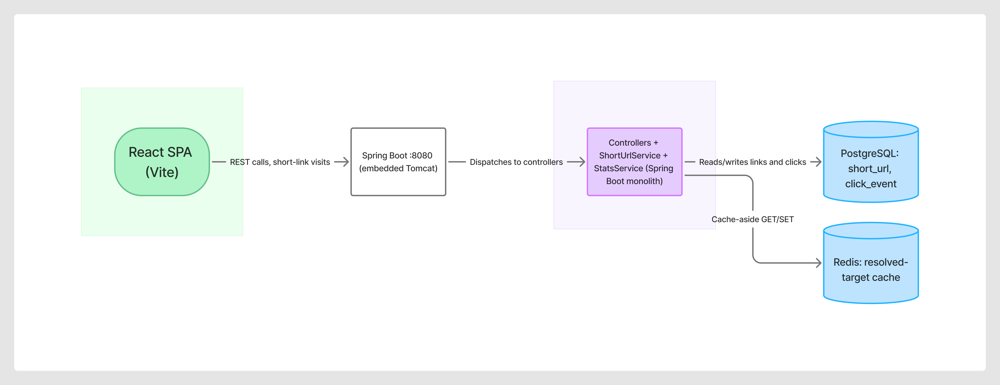
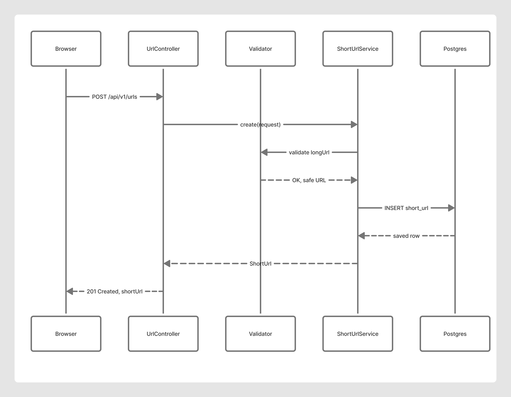
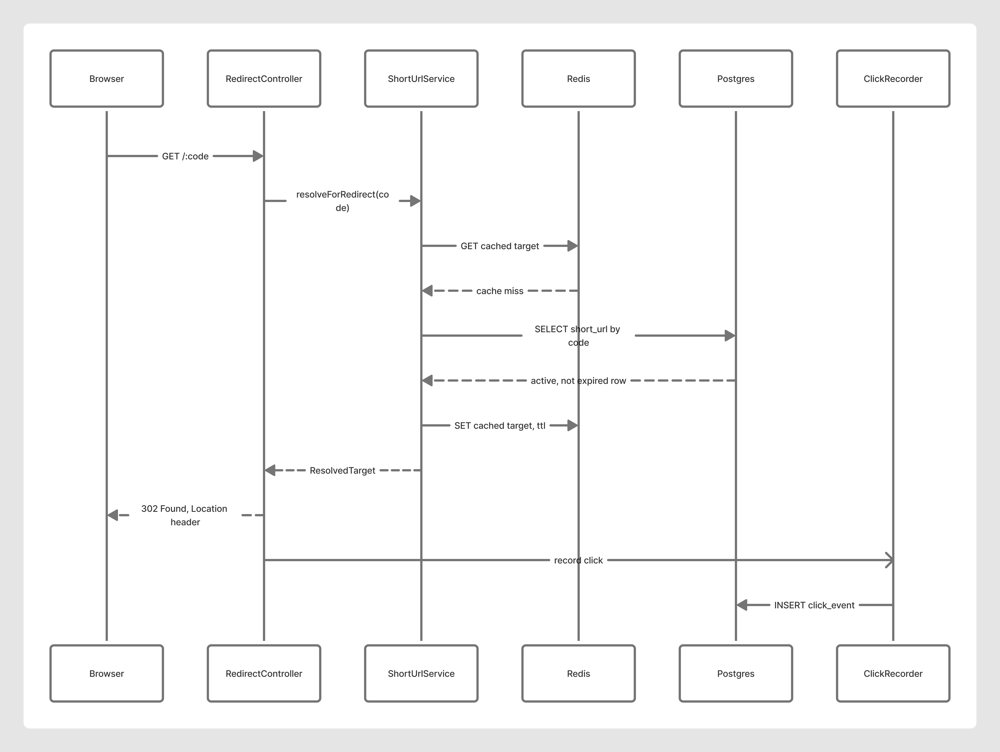

# URL Shortener — Architecture Overview

*Schwab AI-Assisted Engineering Assignment. Author: Madhavi Latha Maddali.*
*Stack: Java 21 / Spring Boot 3 · PostgreSQL · Redis · React frontend.*

> **How to read this doc:** decisions marked **[CONFIRM]** are ones I need to own and be able to
> defend live — the rationale below is my starting position; verify each is genuinely my call before
> submitting. Decisions marked **[DECIDED]** are settled.

---

## 1. Problem framing

A URL shortener is deceptively simple — `long URL in, short code out, redirect on lookup`. The
engineering interest is **not** the happy path; it's the failure modes, because this is a
**read-heavy system on a user's critical path** where the dominant risks are silent:

- **Short-code collision** → a new code silently overwrites an existing mapping → user A's link now
  points to user B's destination. No error thrown. This is the core correctness risk and the design
  is built around eliminating it.
- **Cache / DB divergence** → the cache serves a stale or wrong destination after the source of truth
  changed. Silent.
- **Analytics undercounting** → click tracking silently drops events under load.

The design principle throughout: **fail loudly or degrade safely — never serve a confidently wrong
redirect.** (This is the same silent-failure discipline I apply to batch money-movement systems.)

---

## 2. Requirements

### Functional
- Create a short URL from a long URL (`POST /api/v1/urls`).
- Redirect a short code to its long URL (`GET /{code}`).
- Retrieve click analytics for a code (`GET /api/v1/urls/{code}/stats`).
- **[CONFIRM]** Optional: custom alias, expiration (TTL), delete/deactivate. *Recommend including
  custom alias + expiration — they create good ambiguity/brownfield material. Recommend deferring
  auth/user-accounts as out of scope (state as a limitation).*

### Non-functional
- **Read:write ≈ 100:1** — redirects vastly outnumber creates. Optimize the read path.
- **Redirect latency is user-facing** — target low double-digit ms; cache the hot path.
- **Correctness > availability on create; availability matters on redirect.** A failed *create* is
  recoverable (retry); a wrong *redirect* is a silent integrity failure.
- Short-code space: Base62, 7 chars = 62⁷ ≈ 3.5 trillion — ample.

---

## 3. Key engineering decisions

### 3.1 Short-code generation — **the central decision** **[CONFIRM]**

| Option | Collision risk | Predictable? | Notes |
|---|---|---|---|
| Random Base62 | Yes — needs uniqueness check + retry | No (good) | Simple, but collision handling is mandatory |
| Hash(URL) truncated | Yes — truncation collisions | No | Same URL → same code (dedup), but collisions hard to reason about |
| **Counter + Base62 encode** | **None by construction** | Yes (mild info leak) | Monotonic ID → Base62; zero collisions |

**My recommendation: counter + Base62**, because it *eliminates the collision failure mode
structurally* rather than defending against it — consistent with "design out the silent failure, don't
detect it after." Trade-off: sequential codes are guessable/enumerable (info leak + scraping risk).
**Mitigation:** offset/shuffle the counter or seed with a non-zero start, and note enumeration as a
documented risk. *If you prefer random-with-retry to avoid enumeration, that's a defensible override —
just be ready to explain the collision-retry logic live.*

### 3.2 Storage — PostgreSQL **[DECIDED]**
- Table `short_url(code PK, long_url, created_at, expires_at, active)`.
- Code is the primary key — point lookups are the dominant query.
- **[CONFIRM]** Same long URL submitted twice → new code, or return existing? *Recommend: new code by
  default (URLs aren't unique owners); note idempotency as a possible enhancement. This is a real
  decision an evaluator will probe — have a reason.*

### 3.3 Caching — Redis, cache-aside **[DECIDED]**
- Redirect path: check Redis → miss → read Postgres → populate Redis (TTL). Hot links stay in cache.
- **Failure modes handled explicitly:**
  - Redis down → fall through to Postgres (degraded latency, correct behavior). Never fail a redirect
    just because the cache is down.
  - Stale cache after delete/expire → invalidate on write; TTL as backstop.
  - **Thundering herd**: a hot code expiring under load stampedes Postgres. Mitigate with jittered
    TTLs / single-flight population. (Documented risk even if not fully implemented — scope honestly.)

### 3.4 Analytics — asynchronous, non-blocking **[DECIDED]**
- Click recording must **never block or break the redirect.** Fire-and-forget (async write /
  in-memory buffer → flush). If analytics fails, the redirect still succeeds.
- **[CONFIRM]** Scope of "a click": total vs. unique, bot filtering, geo, real-time vs. batch. *This is
  deliberately the **ambiguous scenario** (see §5) — don't over-build it; normalize and state
  assumptions.*

### 3.5 Redirect status code **[CONFIRM]**
- `301` (permanent, cacheable by browser — fewer hits, worse analytics) vs `302`/`307` (temporary —
  every click reaches us, accurate analytics). *Recommend **302** so analytics stays accurate; note the
  trade-off explicitly. This is a small decision that shows real judgment — evaluators love it.*

### 3.6 Security **[DECIDED]**
- **Open-redirect / malicious-URL guard** — a shortener is a natural phishing vector. Validate scheme
  (http/https only), block internal/loopback ranges, optionally denylist. *This is the security-rigor
  criterion — don't skip it.*
- Input validation (URL well-formedness, length caps).
- Rate limiting on create.
- No secrets in code; env-based config.

---

## 4. System components & control flow

```
        React SPA (aesthetic frontend)
                 │  REST /api/v1
                 ▼
        Spring Boot API  ──►  PostgreSQL (source of truth)
          │   │              
          │   └──►  Redis (cache-aside, hot redirects)
          │
          └──►  Analytics writer (async, non-blocking)
```



Generated from the actual code (controllers, services, cache layer), not from this planning
doc. **Client** (React SPA) → **HTTP entry point** (Spring Boot's embedded Tomcat) → **URL
Shortener API** (the Spring Boot monolith — controllers, `ShortUrlService`, `StatsService`) →
**Data stores** (PostgreSQL for links/clicks, Redis for the cache-aside redirect cache). The
whole backend is modeled as one node, not one per controller — none of the three controllers are
independently deployable, they ship in the same JAR, and decomposing further would misrepresent
the actual deployment unit.

**Create flow:** validate URL → (guard malicious) → allocate code → persist Postgres → return.
**Redirect flow:** Redis lookup → hit: 302 + async click event → miss: Postgres → populate cache →
302 (or 404 if unknown/expired).
**Stats flow:** read aggregated counts for a code.

### Sequence diagrams

Generated from the actual code (controllers, services, cache TTL logic), not from this planning
doc — see each diagram's own annotations for the exact class/method names involved.

**Flow 1 — Create short URL**



`Browser → UrlController → Validator (safety check) → ShortUrlService → Postgres`, ending in
`201 Created`.

**Flow 2 — Resolve short URL and redirect**



`Browser → RedirectController → ShortUrlService`, cache-aside against Redis (shown on a **miss**,
backfilling the cache), then `302 Found` — with the click record fired off as a separate async
message to `ClickRecorder` *after* the redirect, so it can never delay or break it. (A cache
**hit** is shorter: `Browser → RedirectController → ShortUrlService → Redis (hit) → 302` — skips
Postgres entirely.)

---

## 5. The three required scenarios

1. **Greenfield** — build the core create + redirect API from scratch. *Decomposition → execution →
   tests.*
2. **Brownfield** — add the Redis caching layer (or analytics) to the working core. *Impact analysis:
   which modules/flows change, how I avoid regressing the redirect path.* (This mirrors real
   enhancement work — I'll show the before/after and the blast radius.)
3. **Ambiguous** — requirement: *"add analytics."* Under-specified. I normalize it: what is a click,
   unique vs total, bots, real-time vs batch — state assumptions, pick a defensible minimal scope,
   note what I deliberately left out.

---

## 6. Validation & risk control

- **Tests:** unit (code generation, validation, cache logic) + integration (create→redirect→stats
  round-trip, Redis-down fallthrough, expired/unknown code → 404).
- **Quality gates:** lint/static analysis, tests green, dependency/security scan, basic load sanity on
  the redirect path.
- **Risk register:** collision (designed out), cache divergence (invalidate + TTL), analytics loss
  (async, accepted + documented), enumeration (mitigated + documented), open redirect (guarded).
- **Correctness proof:** a test that asserts create→redirect returns the *exact*
  original URL, and that a cache hit and a DB read return *identical* results — parity between cache
  and source of truth, so divergence can't hide.

---

## 7. Assumptions & limitations *(fill as I build — honesty scores)*
- Single-instance prototype; horizontal scale (code-allocation under multiple instances) discussed but
  not implemented.
- Analytics is best-effort, not guaranteed delivery.
- No auth/multi-tenant; out of scope, noted deliberately.
- Analytics lives under `/api/v1/admin/**` (an admin module: per-code stats plus an
  all-links listing) but that path has **no access control** — same "no auth" limitation
  above, just now visible as an unguarded admin surface rather than a hypothetical one.
  Next step before any non-local exposure: HTTP Basic (or similar) in front of `/admin/**`.
- *(add more as they arise — an honest limitations section reads as senior, not weak.)*
